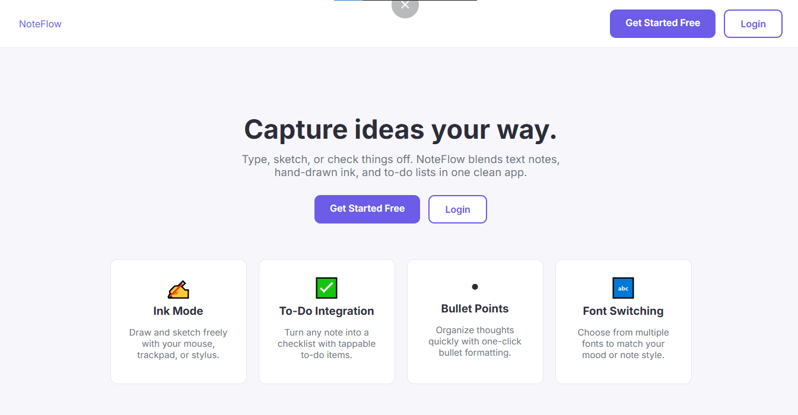
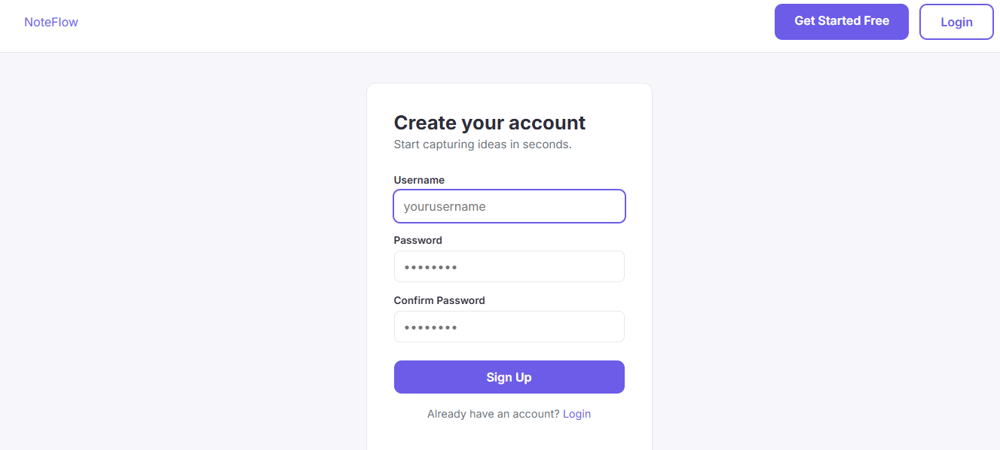
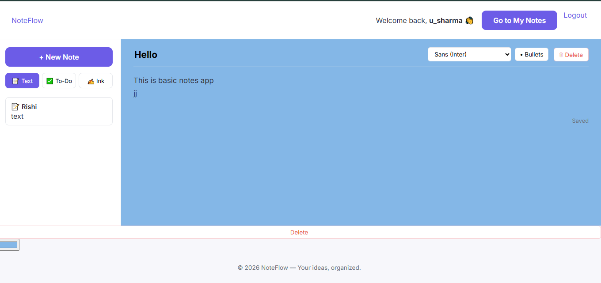
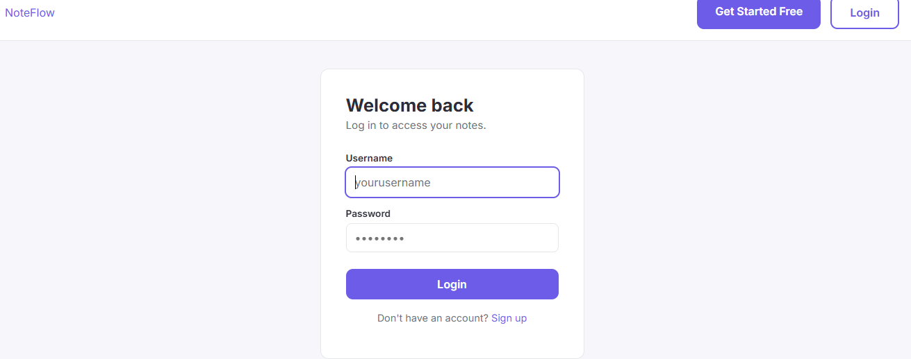

# 📝 NoteFlow

A simple full-stack notes application built with **Node.js, Express.js, MongoDB, and EJS**.

NoteFlow allows users to create an account, securely log in, create and manage personal notes, edit their notes, change note colors, and delete notes.

---

## 🚀 Features

- 🔐 User Signup & Login
- 🔒 Session-based Authentication
- 👤 User-specific notes
- ➕ Create notes
- 📖 View all personal notes
- ✏️ Edit notes
- 🎨 Change note color
- 🗑️ Delete notes
- 💾 MongoDB data persistence
- 📱 Responsive interface
- ⚡ REST API architecture

---

## 🛠️ Tech Stack

### Frontend
- HTML5
- CSS3
- EJS
- JavaScript

### Backend
- Node.js
- Express.js
- REST APIs

### Database
- MongoDB
- Mongoose

### Authentication
- Cookie-based sessions
- bcrypt password hashing

---

## 📸 Screenshots

### Landing Page



---

### Login



---

### Notes Dashboard



---

### MongoDB



---

## 📂 Project Structure

```text
Notes_API/
│
├── controllers/
│   ├── notes.js
│   └── user.js
│
├── middlewares/
│   └── auth.js
│
├── models/
│   ├── notes.js
│   └── user.js
│
├── routes/
│   ├── staticRouter.js
│   ├── user.js
│   └── notes.js
│
├── services/
│   └── auth.js
│
├── public/
│   ├── css/
│   └── js/
│       └── notes.js
│
├── views/
│   ├── partials/
│   ├── home.ejs
│   ├── login.ejs
│   ├── signup.ejs
│   └── notes.ejs
│
├── screenshots/
│   ├── landing.png
│   ├── login.png
│   ├── notes.png
│   └── mongodb.png
│
├── connect.js
├── index.js
├── package.json
└── README.md